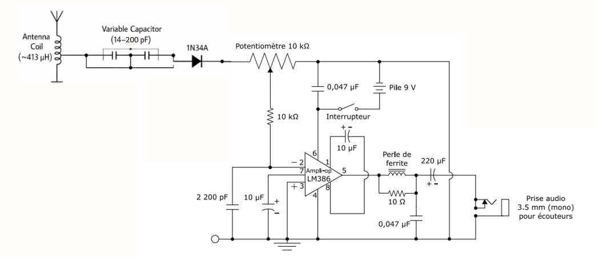

# AM Radio Receiver

## Overview
This project presents the design and implementation of an AM radio receiver built as part of an electromagnetism project.

The receiver is based on four main stages:
- reception of the AM electromagnetic wave using a loop antenna
- frequency selection using an LC resonant circuit
- demodulation using a 1N34A germanium diode
- audio amplification using an LM386 amplifier

## Main components
- loop antenna / copper coil
- 2 TRC210 variable capacitors in parallel
- fixed capacitor
- 1N34A diode
- LM386 audio amplifier
- potentiometer 10 kΩ
- 9 V battery
- 3.5 mm audio jack
- supporting passive components

## Design choices
The circuit was designed to operate in the AM band from 540 kHz to 1600 kHz.

Key design parameters:
- square frame side length: 26.5 cm
- copper wire: 26 AWG
- number of turns: about 18
- calculated inductance: about 413.65 µH
- equivalent maximum capacitance: 210 pF

## Project media

### Circuit photo

### Video presentation
[Watch the project video on YouTube](PASTE_YOUR_YOUTUBE_LINK_HERE)

## Authors
- Abderrahmane Er-Raqabi
- Anis Lalaoui
