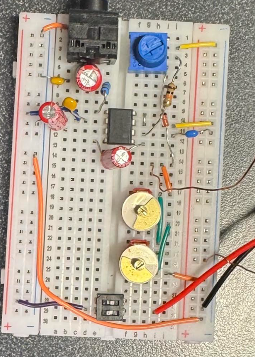

# AM Radio Receiver

## Overview
This project presents the design, construction, and testing of an AM radio receiver developed as part of an electromagnetism project.

The objective was to build a working receiver capable of:
- capturing an AM electromagnetic wave
- selecting a desired station within the AM broadcast band
- demodulating the received signal to recover the audio information
- amplifying the audio signal so it can be heard through earphones or headphones

This project connects theoretical concepts from electromagnetism and AC circuits with practical circuit design and experimental testing.

---

## Operating Principle
The AM radio receiver is based on four main stages:

1. **Reception**  
   A loop antenna made from copper wire captures the electromagnetic wave. The time-varying magnetic flux through the loop induces a voltage in the coil.

2. **Frequency Selection**  
   The coil and capacitors form an LC resonant circuit. By adjusting the capacitance, the resonant frequency changes, allowing the circuit to favor one station while attenuating others.

3. **Demodulation**  
   A 1N34A germanium diode rectifies the AM signal and allows recovery of the audio envelope.

4. **Amplification**  
   The recovered audio signal is still weak, so an LM386 audio amplifier is used to drive low-impedance earphones or headphones.

---

## Main Components
The receiver uses the following main components:

- copper loop antenna / coil
- 2 TRC210 variable capacitors connected in parallel
- 1 fixed capacitor
- 1N34A germanium diode
- LM386 audio amplifier
- 10 kΩ potentiometer for volume control
- 9 V battery
- 3.5 mm audio jack
- supporting passive components:
  - coupling capacitors
  - filtering capacitors
  - resistors
  - ferrite bead
  - switch

---

## Design Choices

### 1. Loop Antenna / Coil
The antenna was built as a square loop using copper wire wound around a cardboard frame.

Chosen parameters:
- square frame side length: **26.5 cm**
- wire gauge: **26 AWG**
- practical number of turns: **18**
- calculated inductance: **about 413.65 µH**

The loop plays a double role:
- it acts as the receiving antenna
- it also provides the inductance \(L\) of the resonant LC circuit

### 2. Capacitive Tuning Network
To obtain a useful tuning range, two TRC210 variable capacitors were connected in parallel.

Capacitance values:
- variable capacitors range: **about 14 pF to 200 pF**
- fixed capacitor: **10 pF**
- equivalent maximum capacitance: **210 pF**

This choice was made to ensure that the LC circuit could cover the AM broadcast band.

### 3. Resonant Frequency Target
The circuit was designed to operate in the AM broadcast band:

- **540 kHz to 1600 kHz**

Using the resonance relation:

\[
f_0 = \frac{1}{2\pi\sqrt{LC}}
\]

the target inductance and capacitance range were selected so the receiver could tune across that interval.

### 4. Audio Amplification
A simple passive crystal-radio style output would not have been sufficient for common low-impedance earphones.  
For that reason, an LM386 amplifier was added to:
- amplify the recovered audio signal
- preserve usability with standard headphones or earphones
- provide practical volume control through a 10 kΩ potentiometer

---

## Calculated Values
Key design values used in the project:

- AM band target: **540 kHz to 1600 kHz**
- capacitance range: **14 pF to 200 pF**
- fixed capacitor: **10 pF**
- maximum equivalent capacitance: **210 pF**
- calculated inductance: **413.65 µH**
- theoretical number of turns: **17.46**
- practical number of turns used: **18**

These values were used to dimension the receiving loop and the tuning circuit.

---

## Project Media

### Circuit concept / project image

### Real circuit photo

### Video presentation
[Watch the project video on YouTube](https://youtube.com/shorts/N03W0twUTz0)

---

## Practical Notes
During testing, the receiver required careful adjustment because AM reception is sensitive to several factors:

- small variations in capacitance shift the resonant frequency
- the loop antenna orientation affects reception quality
- wire connections must be short and stable
- the coil ends must make proper electrical contact
- the signal before amplification is very weak, so noise and poor contacts strongly affect performance

Tuning was achieved by adjusting the variable capacitors until a station became audible in the earphones.

---

## What This Project Demonstrates
This project illustrates several important physical and electrical concepts:

- electromagnetic induction in a loop antenna
- magnetic flux variation and induced voltage
- LC resonance and frequency selectivity
- AM demodulation using a diode
- low-power audio amplification using an integrated amplifier

It is a compact example of how electromagnetic theory can be applied to build a functional communication device.

---

## Repository Contents
This repository includes:
- project images
- circuit photos
- project documentation
- video presentation link

Files:
- `circuitradio.png`
- `realcircuit.png`

---

## Authors
- **Abderrahmane Er-Raqabi**
- **Anis Lalaoui**
